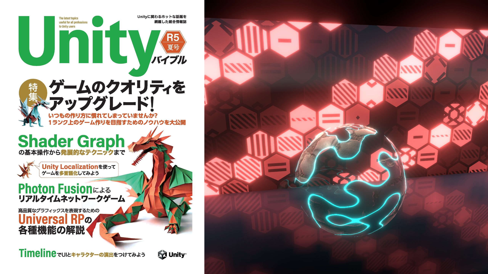
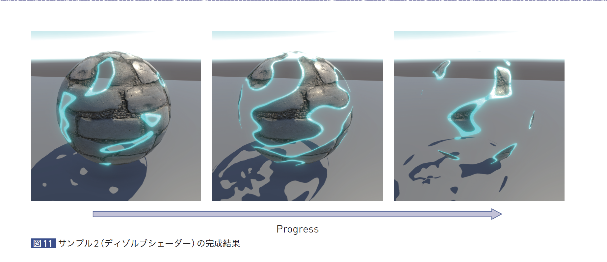
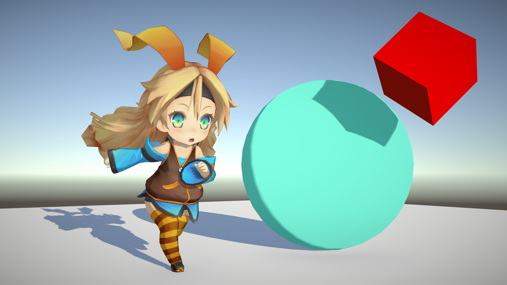

# Unityバイブル R5夏号：Shader Graphの基本操作から発展的なテクニックまで

これは[Unityバイブル R5夏号](https://amzn.to/3QC10LR)のSECTION01「Shader Graphの基本操作から発展的なテクニックまで」のサンプルプロジェクトです。

## バージョン情報

- Unity 2022.3.6f1 LTS
- URP／Shader Graph 14.0.8

## 関連記事

- [『Unityバイブル R5夏号』の「Shader Graphの基本操作から発展的なテクニックまで」を執筆しました | gam0022.net](https://gam0022.net/blog/2023/08/07/unity-bible/)

## サンプルシーン一覧

[Assets/ShaderGraphTutorial](Assets/ShaderGraphTutorial)のディレクトリに5つのサンプルシーンがあります。

### サンプル1：基本操作とPBRテクスチャ対応シェーダー

- `Assets/ShaderGraphTutorial/01_PBRTexture/ARMTex.unity`

### サンプル2：ディゾルブシェーダー

- `Assets/ShaderGraphTutorial/02_Dissolve/Dissolve.unity`

### サンプル3：ToonシェーダーとCustom Function

- `Assets/ShaderGraphTutorial/03_Toon/Toon_NoShadow.unity`
- `Assets/ShaderGraphTutorial/03_Toon/Toon_Shadow.unity`

ユニティちゃん © Unity Technologies Japan/UCL

### サンプル4：プロシージャルテクスチャ

- `Assets/ShaderGraphTutorial/04_ProceduralTexture/ProceduralTexture.unity`

### サンプル5：ポストエフェクト

- `Assets/ShaderGraphTutorial/05_PostProcessing/PostProcessingDiagonalStripe.unity`

- `Assets/ShaderGraphTutorial/05_PostProcessing/PostProcessingDistortion.unity`

- `Assets/ShaderGraphTutorial/05_PostProcessing/PostProcessingDistortion.unity`

- `Assets/ShaderGraphTutorial/05_PostProcessing/PostProcessingGlitch.unity`

# ライセンス

サンプルコードはMITライセンスですが、外部アセットについては以下のライセンスにしたがってください。

- UnityChan
    - © Unity Technologies Japan/UCL
    - [ユニティちゃんライセンス条項](https://unity-chan.com/contents/guideline/)
- Cobblestone Floor 08 Texture • Poly Haven
    - Author: Rob Tuytel
    - [ダウンロード元](https://polyhaven.com/a/cobblestone_floor_08)
    - CC0ライセンス